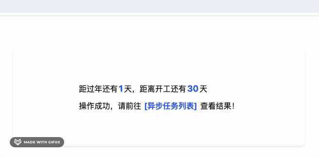

# HighlightText example

WHY? [看这里](https://juejin.cn/post/7332388389945802788)  
如何给字符串中的某一部分文字添加样式？   




实现上面的效果，只需要：

```tsx
<HighlightNumber 
  content={'距过年还有1天，距离开工还有30天'}
  onTargetClick={({index, target}) => {
    if (index === 0) {
      alert(`距过年还有${target}天`)
    } else if (index === 1) {
      alert(`距开工还有${target}天`)
    }
  }} 
/>
```
and 

```tsx
<HighlightText
  content={'操作成功，请前往 [异步任务列表] 查看结果！'}
  pattern={/\[.+\]+/g}
  onTargetClick={() => {
    alert('前往异步任务列表')
  }}
/>
```